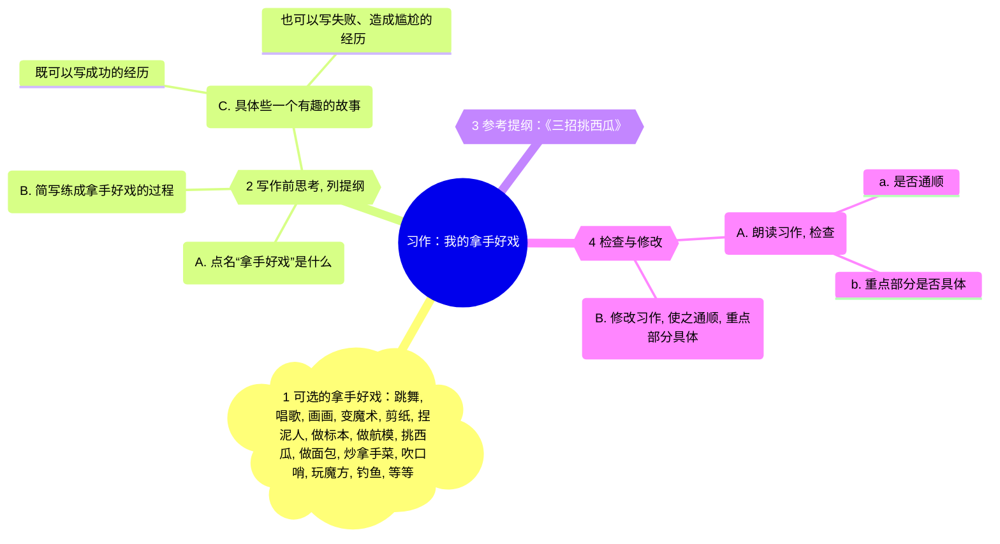

```mermaid
mindmap
((习作：我的拿手好戏))
    ) 1 可选的拿手好戏：跳舞, 唱歌, 画画, 变魔术, 剪纸, 捏泥人, 做标本, 做航模, 挑西瓜, 做面包, 炒拿手菜, 吹口哨, 玩魔方, 钓鱼, 等等(  
    {{2 写作前思考, 列提纲}}  
        (A. 点名“拿手好戏”是什么)  
        (B. 简写练成拿手好戏的过程)  
        (C. 具体些一个有趣的故事)  
            既可以写成功的经历  
            也可以写失败、造成尴尬的经历  
    {{3 参考提纲：《三招挑西瓜》}}  
    {{4 检查与修改}}  
        (A. 朗读习作, 检查)  
            a. 是否通顺  
            b. 重点部分是否具体  
        (B. 修改习作, 使之通顺, 重点部分具体)  
```
